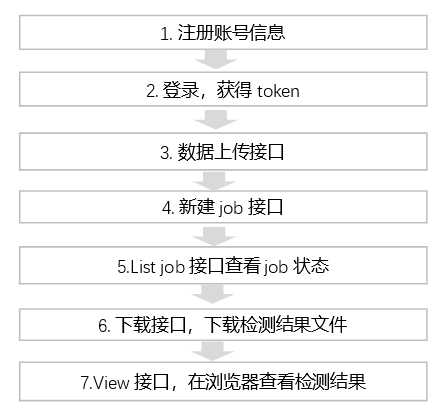

# **12Sigma帮助文档**

## **开发指南**
### 基本概念介绍  
### 签名
#### 访问秘钥 

访问密钥是12Sigma为用户使用API来访问12Sigma资源设计的"安全口令"。你可以用它来签名API请求内容以通过服务端的安全验证。该访问密钥成对（AccessKeyId与AccessKeySecret）生成和使用。

#### 鉴权方式和请求签名 
鉴权方式(二选一)： 
>1. 采用“请求签名”，即：直接使用 key/secret，生成请求签名，Header中附带Authorization访问， 如 key：UwGkh5ZfEEpGAKw== secret: /aGblWRok9RTJ+5WQ= 
>2. 采用token, 即：登录后获取 token，Header中使用 token 访问，token 有效期为 24 小时 

下面讲解请求签名的内涵：
为了保证用户数据的安全，12Sigma API的所有HTTP请求都必须经过安全验证。目前，该安全验证基于12Sigma访问密钥，使用对称加密算法完成的。其工作流程如下：
>* 请求端根据API请求内容（包括HTTP Header和Body）生成签名字符串；
>* 请求端使用12Sigma的访问密钥对（AccessKeyID和AccessKeySecret）对第一步生成的签名字符串进行签名，形成该API请求的数字签名；
>* 请求端把API请求内容和数字签名一起发给服务端；
>* 服务端在接到请求后会重复第一、二两步工作并在服务端计算出该请求期望的数字签名；（注：服务端会在后台取得该请求使用的用户访问密钥对）
>* 服务端用期望的数字签名和请求端发送过来的数字签名做对比，如果一致则认为该请求通过安全验证，否则拒绝该请求。 通过上述安全验证流程，我们可以达到以下目的: 1. 确认是谁在做API请求：发送请求前需要用户指定生成数字签名的密钥对，在服务端可通过该密钥对确定用户身份，进而可做访问权限管理; 2.确认用户请求在网络传输过程中有没有被篡改：服务端会对接收到的请求内容重新计算数字签名，一旦请求内容在网络上被篡改，则无法通过数字签名比对。

#### 在header中包含签名：
##### Authorization字段计算的方法:
```
"Authorization: 12sigma " + AccessKeyId + ":" + Signature
Signature = base64(hmac-sha1(AccessKeySecret,
      VERB + "\n"
      + Content-MD5 + "\n"
      + Content-Type + "\n"
      + Date + "\n"
      + CanonicalizedSGHeaders
      + CanonicalizedResource))
```
>* AccessKeySecret表示签名所需的密钥；
>* VERB表示HTTP请求的方法名称，如PUT、GET等；
>* Content-MD5表示请求内容数据的MD5值，详情参照RFC2616；
>* Content-Type表示请求内容的类型；
>* Date表示此次操作的时间，且必须为HTTP1.1中支持的GMT格式，内容为HTTP的Date请求头。如果存在x-sigma-date，则以此头中所标识的时间为准；
>* CanonicalizedSGHeaders表示以"x-sigma-"为前缀的HTTP Header的组合；
>* CanonicalizedResource表示用户想要访问的12Sigma服务的资源。

其中，Date和CanonicalizedResource不能为空；如果请求中Date所表示的时间与服务器接收到该请求的时间最大可接受误差为15分钟，如果超过15分钟服务器端会拒绝该请求。

> 构建CanonicalizedSGHeaders的方法:  

所有以"x-sigma-"为前缀的HTTP Header被称为CanonicalizedSGHeaders。它的构建方法如下：
1.	将所有以"x-sigma-"为前缀的HTTP Header请求头的名字转换成小写字母，如"x-sigma-Auth-Sign:Test"转换成"x-sigma-auth-sign:Test
2.	将上一步得到的所有HTTP 请求头按照名字的字典序进行升序排列；
3.	如果有相同名字的请求头，则根据标准RFC2616 4.2章进行合并(两个值之间只用逗号分隔)。例如两个名为"x-sigma-auth-sign"的请求头，对应的值分别为"Test"和"Alpha"，则合并后为"x-sigma-auth-sign:Test,Alpha";
4.	删除请求头和内容之间分隔符两端出现的任何空格。如"x-sigma-auth-sign: Test,Alpha"转换为"x-sigma-auth-sign:Test,Alpha"
5.	将所有的头和内容用"\n"分隔符分隔拼成最后的CanonicalizedSGHeaders。


##### 构建CanonicalizedRresource的方法:

用户发送请求中想访问的12Sigma服务的目标资源被称为CanonicalizedRresource，它的构建方法如下：
1.	将CanonicalizedRresource置为空字符串(" ");
2.	放入要访问的12Sigma服务资源，如"/datas/dataname"(无dataname则不填)；
3.	如请求包含查询字符串(QUERY_STRING)，则在CanonicalizedRresource字符串尾部添加"?"和查询字符串。
4.	其中QUERY_STRING是URL中请求参数按字典排序后的字符串，其中参数名和值之间用"="(等号)相隔组成字符串，并对参数名-值对按照字典序升序排序，然后以"&"符号连接构成字符串。其公式化描述如下：

$$QUERY_STRING = "KEY1=VALUE1" + "&" + "KEY2=VALUE2"$$


##### 签名示例
```
    我们举例来演示整个过程，
    假设访问密钥对如下：
        AccessKeyId = "fZO4DKcnHmGfA5NRBdq0gg=="
        AccessKeySecret = "zLbqgrnwnqFbX5w9Il3gDikKxZo="

    用户需Get请求studylist，其HTTP请求如下：
    'Connection': 'keep-alive', 
    'Accept-Encoding': 'gzip, deflate', 
    'Accept': '*/*', 
    'User-Agent': 'python-requests/2.20.1'

    请求生成的签名字符串为
    GET\n\n\nWed, 27 Feb 2019 09:55:00 GMT\n/accounts/sigma/jobs/studylist/

    转换得到的签名为:
    ZrFwtKEUGgyITeC+7LL2aD1SqGVEUCNloy9yGhMIQOQ=


    最后发送经过数字签名的请求内容如下：
    'Accept-Encoding': 'gzip, deflate', 
    'Accept': '*/*', 
    'User-Agent': 'python-requests/2.20.1', 
    'Connection': 'keep-alive', 
    'Date': 'Wed, 27 Feb 2019 09:55:00 GMT', 
    'Authorization': '12Sigma fZO4DKcnHmGfA5NRBdq0gg==:ZrFwtKEUGgyITeC+7LL2aD1SqGVEUCNloy9yGhMIQOQ='
```
---

## **API接入工具**
### Java 接入工具
https://github.com/

### Python 接入工具
https://github.com/yuzhao12sigma/sigmacloudSDK

---
## **接入流程图**

---

## **API参考**
### API入门
#### API调用——原理
API是HTTP API。常用的编程语言都能发起HTTP请求（通过第三方库或自带API），使用者向我们的服务器发起HTTP请求，并加上合适的参数，服务器将会对请求进行处理，得到结果将会返回给使用者。

#### API调用——鉴权
创建账户会生成一组对应的 api_key 和 api_secret，用以识别用户是否有权限调用 API，所有的API调用必须提供对应的一组 api_key 和 api_secret 参数。

#### API调用——参数
调用每个API需要根据需求传不同的参数，每个API参数的详细定义请查看下文详情 。

#### 通用返回值


|字段|类型|说明|
|:----|:----|:----|
|message|字符串|请求返回的提示消息（英文）|
|message_chs|字符串|请求返回的提示消息（中文）|
|data|字典|请求返回的数据包含在这个字典内|
|error|字典|错误信息，错误代码，包含message(英文的error信息),message_chs（中文的error信息）,code(错误码)|

#### 通用的ERROR_MESSAGE
|HTTP状态码（status）|错误码（Error Code）|错误消息（Error Message）|描述（Description）| 
|:---|:---|:---|:---|
|400|InvalidAPIVersion|Invalid API Version: {API Version}|无效API版本号|
|400|NotImplementedAPIVersion|Not implemented API Version: {API Version}|未实现的API版本|
|403|NotImplementMethod|Not implemented method.	|未实现接口|
|401|UnauthorizedResource|Unauthorized resource|未授权|
|400|InvalidSignatureMethod|Signature method {method} is not supported.|不支持的签名方法。|
|400|IllegalAuthorization|Authorization field value {value} is illegal.|无效的Authorization格式。|
|400|InvalidAccessKeyId|Invalid AccessKeyId format: {format}.|无效的AccessKeyId格式。|
|400|MissingDate|Date field is empty.|HTTP标准请求头Date为空或不存在。|
|403|UnauthorizedAccessKey|The AccessKeyId is unauthorized.|提供的AccessKeyId值未授权。|
|403|SignatureNotMatch|Authorization signature is not correct, please verify AccessKeyId or AccessKeySecret.|Authorization签名不正确, 请检查AccessKeyId或AccessKeySecret。|
|403|RequestTimeSkewed|Date within request has been expired. request time: {time}|请求的发送时间超过当前服务处理时间前后15分钟的范围。|
|403|ContentMD5NotMatch|Content-MD5 does not match content md5.|内容计算的MD5值与Content-MD5不一致。|
|403|Forbidden|The credential is forbidden to access the resource.|使用当前身份访问资源时被禁用|
|500|InternalServerError|Internal server error message|服务器内部错误|


### 公共HTTP头定义  
#### 公共请求头（Common Request Headers）

|名称|类型|必选|说明|
|:----|:----|:----|:----|
|Accept|字符串|可选|客户端希望服务端返回的类型，支持JSON|
|Accept-Encoding|字符串|可选|客户端希望服务端返回的压缩算法，例如：gzip
|Authorization|字符串|可选|签名内容，具体样式见签名部分说明,用于鉴权|
|Sigma-Token|字符串|可选|登入获得的token,用于鉴权|
|Content-Language|字符串|可选|请求Body 所采用的自然语言|
|Content-Length|字符串|可选|请求Body的长度|
|Content-MD5|字符串|可选|请求Body经过MD5计算后的字符串，计算结果为大写|
|Content-Type|字符串|可选|请求 Body 类型，如果没有Body部分，则不需要提供该请求头|
|Date|字符串|必要|当前请求发送时间， 使用GMT标准时间。格式化字符串如下：%a, %d %b %Y %H:%M:%S GMT (如：Mon, 3 Jan 2010 08:33:47 GMT)|
|Host|字符串|可选|HTTP请求完整HOST名字|
|x-sigma-api-version|字符串|可选|API版本号，默认为最新版本。|
|x-sigma-date|字符串|可选|当前发送时刻的时间，格式与Date一直。如果请求中包含改公共请求头，它的值会取代Date标准头的值用于服务器请求验证。无论是否有x-sigma-date，HTTP标准Date头都必须提供。|
|x-sigma-signature-method|字符串|可选|签名计算方法，默认值为hmac-sha1-v1|


说明：
请求中Date所表示的时间与服务器接收到该请求的时间最大可接受误差为15分钟，如果超过15分钟服务器端会拒绝该请求。如果请求中设置了x-sigma-date头部，则该时间误差计算基于x-sigma-date头的值  


#### 公共响应头（Common Response Headers）   

|名称|类型|描述|  
|:--|:--|:--|
|x-sigma-request-id|字符串|服务端生成的表示该请求的唯一ID。主要用于跟踪和调查问题。若用户希望调查出现问题的API请求，可以提供该ID|
|Content-Length|字符串|HTTP响应内容的长度|
|Content-MD5|字符串|HTTP响应内容的MD5|
|Content-Type|字符串|HTTP响应内容类型，例如：JSON|
|Date|字符串|当前请求返回时间，使用GMT标准时间。格式化字符串如下：a, %d %b %Y %H:%M:%S GMT (如：Mon, 3 Jan 2010 08:33:47 GMT)


---

### API概览

### 关于login/logout的操作
|API|描述| 
|:--|:--|
|Login|登入，会返回token,用于鉴权|
|Logout|登出|

### 关于store的操作
|API|描述| 
|:--|:--|
|Upload|上传文件，上传一组dcm分2步：1.先调用POST方法，2.调用PUT方法|
|DownloadFile|下载文件，用于下载json文件（ai检测结果）|

### 关于job的操作  
|API|描述|
|:--|:--|
|NewJob|创建job|
|GetJob|获取job信息|
|ListJobs|获取job信息列表|
|GetJobStudyList|获取studylist|

### 结果显示页
|API|描述|
|:--|:--|
|view|通过浏览器查看检测结果，结节情况等信息|


### 关于login/logout的操作
#### Login
#####  描述
```
    用户登入
```
##### 调用url
```
    https://api.12sigma.ai/login
```
##### 调用方法
```
    GET
```
##### 请求参数
|参数名|类型|是否必选|参数说明| 
|:--|:--|:--|:--|
|account_name|字符串|必选|账户名|
|user_name|字符串|必选|用户名|
|password|字符串|必选|密码| 
|force_new|字符串|必选|是否强制登录，踢session，默认值"False"|

##### 返回值示例
###### 请求成功返回示例
```
{
    "url": "",
    "message": "User login successfully.",
    "message_chs": "用户登录成功.",
    "data": {
        "user_info": {
            "account_id": "5c23a24a411a",
            "password": "1cb4c12ef1dbb18503347623aaf5b3d442fcac",
            "description": "12sigma",
            "access_key": "9OBDzzzzXHjw==",
            "display_name": "test",
            "name": "test",
            "mobile": "18888888888",
            "token": "eyJhbm6XjGncYzKw_gHP_k=",
            "user_level": "12sigma",
            "secret_key": "53gIkatMIatAZBy4=",
            "_id": "5c23a24ae411e",
            "type": "User",
            "email": "test@12sigma.ai",
            "sys_user": false
        },
        "user_name": "test",
        "account_name": "sigma"
    },
    "error": {
        "message": "",
        "code": "",
        "message_chs": ""
    }
}   

```
##### 请求失败返回示例
```
     {"message": "", 
      "message_chs": "", 
       "data": {}, "url": "",
       "error": {"code": e.error_code_name, 
                     "message": e.message,
                     "message_chs": e.message_chs}}

```
##### 请求示例
```
GET /login?account_name=account&user_name=test&password=MTIzNDU2&force_new=False HTTP/1.1
Header:
    Host: api.12sigma.ai
    Connection: keep-alive
    Accept-Encoding: gzip, deflate
    Accept: */*
    User-Agent: python-requests/2.13.0
```
##### 返回示例：
```
Header:
   Date: Mon, 25 Feb 2019 06:21:49 GMT
   x-sg-request-id: 5c73897de05cc108cd4ce9e6
   Content-Type: application/json; charset=utf-8
   Content-MD5: SC37Zqf1XDFu88Plqq0jNA==
   Content-Length: 957
   Access-Control-Allow-Origin: *
   Server: Werkzeug/0.12.2 Python/2.7.6
```


#### Logout
#####  描述
```
    用户登出
```
##### 调用url
```
    https://api.12sigma.ai/logout
```
##### 调用方法
```
    DELETE
```

##### 请求头
|Header名|是否必选|参数说明| 
|:--|:--|:--|
|Sigma-Token|必选|登录接口返回的token信息|

##### 返回值示例
###### 请求成功返回示例
```
{
	"url": "",
	"message": "User logout successfully!",
	"message_chs": "用户登出成功",
	"data": {},
	"error": {
		"message": "",
		"code": "",
		"message_chs": ""
	}
}

```
##### 请求示例
```
DELETE /logout HTTP/1.1
Header:
    Host: api.12sigma.ai
    Connection: keep-alive
    Accept-Encoding: gzip, deflate
    Accept: */*
    User-Agent: python-requests/2.13.0
    Sigma-Token: eyJhbGciOiAiSFMyHVlLCAyHTVRYThL0=
    Date: Mon, 25 Feb 2019 06:31:28 GMT
```
##### 返回示例
```
Header:
    Date: Mon, 25 Feb 2019 06:31:27 GMT
    x-sg-request-id: 5c738bbfe05cc108cd4ce9e9
    Content-Type: application/json; charset=utf-8
    Content-MD5: zWoxkQmIfGbjvU/0z7FLRQ==
    Content-Length: 175
    Access-Control-Allow-Origin: *
    Server: Werkzeug/0.12.2 Python/2.7.6
```

### 关于store的操作  
#### Upload（POST）
#####  描述
```
    检测所需要的数据一般要求是薄层dicom图，每个series一般有百余张dicom图像，
    批量上传dicom文件，第一步是调用POST方法，获得upload_id
```
##### 文件要求
```
    文件格式：dcm
```
##### 调用url
```
    https://api.12sigma.ai/accounts/<res_account_name>/store/uploads/<groupname>/
    提示：这个groupname要求是series_id
```
##### 调用方法
```
    POST
```
##### 请求参数
|参数名|类型|是否必选|参数说明| 
|:--|:--|:--|:--|
|groupname|字符串|必选|要求是series_id,来标识这组dcm图|
|quantity|字符串|必选|要求是这个series的dcm实际总数，例如"200"|
|converted|字符串|必选|是否dcm转nii，需要写"1"|
|overwrite|字符串|必选|是否覆盖同名文件，需要写"1"|


##### 返回值示例
###### 请求成功返回示例
```
{
	"url": "",
	"message": "Initial multi upload",
	"message_chs": "初始化分块上传",
	"data": {
		"upload_id": "54f49e2435e211e9980aac1f6b91e556_182"
	},
	"error": {
		"message": "",
		"code": "",
		"message_chs": ""
	}
}

```

##### 请求示例：  
```
POST /accounts/sigma/store/uploads/1.3.12.2.1107.5.1.4.1336.30000014091500302045300006765/ HTTP/1.1
Header:
    Host: api.12sigma.ai
    Connection: keep-alive
    Accept-Encoding: gzip, deflate
    Accept: */*
    Sigma-Token: eyJhbGciOvbiwgMjUgRmViIqOWNZJzIa5qTA0oJdVBg=
    Content-Length: 65
```

##### 返回示例：
```
Header:
    Date: Mon, 25 Feb 2019 03:54:24 GMT
    x-sg-request-id: 5c7366f0e05cc1125363e24e
    Content-Type: application/json; charset=utf-8
    Content-MD5: RYolNa+HWzZ/S2eDWXFK5A==
    Content-Length: 223
    Access-Control-Allow-Origin: *
    Server: Werkzeug/0.12.2 Python/2.7.6
```


#### Upload（PUT）
#####  描述
```
    Upload用于上传单个dcm文件，每个PUT请求上传一张dcm，因此你需要多次调用PUT上传
```
##### 文件要求
```
    文件格式：dcm，或者json等
```
##### 调用url
```
    https://api.12sigma.ai/accounts/<res_account_name>/store/uploads/<filename>/
```
##### 调用方法
```
    PUT
```

##### 请求Header
|Header名|是否必选|参数说明| 
|:--|:--|:--|
|Sigma-Token|必选|登录接口返回的token信息|
|Content-Length|必选|文件大小|
|Content-MD5|必选|文件的md5值|

##### 请求参数
|参数名|类型|是否必选|参数说明| 
|:--|:--|:--|:--|
|filename|字符串|必选|文件名|
|upload_id|字符串|必选|此值为POST上传返回的upload_id|


##### 返回值示例
###### 请求成功返回示例
```
{
   'url': '', 
   'message': 'Upload C:\\Users\\12sigma\\Desktop\\1961551\\a_0136.dcm succeed', 
   'message_chs': '文件 C:\\Users\\12sigma\\Desktop\\1961551\\a_0136.dcm 上传成功', 
   'data': {
	        	'upload_id': 'eef5653a35e211e9980aac1f6b91e556_182'
    }, 
   'error': {
	        	'message': '',
		        'code': '',
		        'message_chs': ''
	}
}

```


##### 请求示例：  
```
PUT /accounts/sigma/store/uploads/1.3.12.2.106765/?upload_id=eef5653a35e211e998 HTTP/1.1
Header:
    Host: api.12sigma.ai
    Connection: keep-alive
    Accept-Encoding: gzip, deflate
    Accept: */*
    Sigma-Token: eyJhbGciOvbiwgMjUgRmViIqOWNZJzIa5qTA0oJdVBg=
    Content-Length: 65
    Content-MD5: u4syhbSRcatNUM6G0rmCGw==
```

##### 返回示例：
```
Header:
    Date: Mon, 25 Feb 2019 04:08:38 GMT
    x-sg-request-id: 5c736a46e05cc1125363e27d
    Content-Type: application/json; charset=utf-8
    Content-MD5: u4syhbSRcatNUM6G0rmCGw==
    Content-Length: 308
    Access-Control-Allow-Origin: *
    Server: Werkzeug/0.12.2 Python/2.7.6
```


#### DownloadFile
##### 描述
```
    DownloadFile用于下载文件，一般是计算结果json文件，或者下载单张dcm文件
```
##### 调用url
```
    https://api.12sigma.ai/accounts/<res_account_name>/store/downloads/
```
##### 调用方法
```
    GET
```
##### 请求头
|Header名|是否必选|参数说明| 
|:--|:--|:--|
|Sigma-Token|否|登录接口返回的token信息|

##### 请求参数
|名称|类型|是否必须|描述| 
|:--|:--|:--|:--|
|filename|字符串|必选|文件名|


##### 返回值示例
###### 请求成功返回示例
```
返回文件流
```


##### 请求示例：  
```
GET /accounts/sigma/store/downloads/?filename=1.3.12.2.1107.5.1.4.13300006765.json HTTP/1.1
Header:
    Host: api.12sigma.ai
    Connection: keep-alive
    Accept-Encoding: gzip, deflate
    Accept: */*
    User-Agent: python-requests/2.13.0
    Sigma-Token: eyJhbGciOiAiTWCIk1vbiwgMjUgRm
```
##### 返回示例：
```
Header:
    Date: Mon, 25 Feb 2019 04:21:39 GMT
    x-sg-request-id: 5c736d53e05cc1125363e287
    Content-Type: application/json; charset=utf-8
    Content-MD5: UCR+Dnl0mw++4YzDR6cyuQ==
    Content-Length: 141
    Access-Control-Allow-Origin: *
    Server: Werkzeug/0.12.2 Python/2.7.6
```


### 关于job的操作
#### NewJob
##### 描述
```
    NewJob用于创建肺结节检测和肺结节随访的计算job
```
##### 调用url
```
    https://api.12sigma.ai/accounts/<res_account_name>/jobs/"
```
##### 调用方法
```
    POST
```
##### 请求参数
|名称|类型|是否必须|描述| 
|:--|:--|:--|:--|
|account_name|字符串|是|账户名|
|user_name|字符串|是|用户名|
|study_id|字符串|是||
|series_id|字符串|是|数据全局唯一ID|
|patient_id|字符串|是|患者id|
|format|字符串|是|数据文件类型，默认传“nii”|
|filename|字符串|是|数据文件名称|
|job_type|字符串|是|计算job的类型，例如：肺结节检测（lung_nodule_detection）|
|priority|字符串|是|优先级，默认传 2|
|type|字符串|是|默认写“file”|
|notify|字符串|否|是否在计算成功后通知调用方，"1"表示通知，"0"表示不通知|
|notify_url|字符串|否|如果notify参数是"1"，则此参数需要填写，例如："http://xxx/"|
|notify_info|字典|否|如果有额外信息需要传入，可以写在这里|


##### 返回值示例
###### 请求成功返回示例
```
{
	"url": "",
	"message": "new job successfully!",
	"message_chs": "新建作业成功！",
	"data": {
		"job_id": "job-bca0e97a-253d-11e9-980a-ac1f6b91e556"
	},
	"error": {
		"message": "",
		"code": "",
		"message_chs": ""
	}
}
```
###### 请求失败返回示例
```
{
	"url": "",
	"message": "",
	"message_chs": "",
	"data": {},
	"error": {
		"message": "Invalid input, the input job type is invalid!",
		"code": "InvalidParameter",
		"message_chs": "输入错误，输入的作业类型（job_type）参数非法!"
	}
}
```

##### 请求示例：  
```
POST /accounts/sigma/jobs/ HTTP/1.1
Header:
  Authorization: 12Sigma 9OBDzzzzX7+TZHjw==:cXP66NVF1MrkEQT0ETK7Teg=
  Date: Thu, 31 Jan 2019 02:15:53 GMT
  Host: api.12sigma.ai
  Connection: keep-alive
  Accept-Encoding: gzip, deflate
  Accept: */*
  User-Agent: python-requests/2.13.0
  Content-Length: 350
```

##### 返回示例：
```
Header:
  Date: Thu, 31 Jan 2019 02:15:52 GMT
  x-sg-request-id: 5c525a58e05cc11c1a6eaaa0
  Content-Type: application/json; charset=utf-8
  Content-MD5: JzCEHspmS0FRhlGdHOqdmw==
  Content-Length: 229
  Server: nginx/1.4.6
```

#### GetJob
##### 描述
```
    获取job信息
```
##### 调用url
```
    https://api.12sigma.ai/accounts/<res_account_name>/jobs/<job_id>/
```
##### 调用方法
```
    GET
```
##### 请求参数
|名称|类型|是否必须|描述| 
|:--|:--|:--|:--|
|job_id|字符串|是|拼接在url中|

##### 返回值示例
###### 请求成功返回示例
```
{
	"url": "",
	"message": "get job information successfully!",
	"message_chs": "获取作业信息成功!",
	"data": {
		"status": "success",
		"tasks": [{
			"status": "waiting",
			"timestamp": null,
			"task_id": "task-eb1248dc-2f54-11e9-980a-ac1f6b91e556"
		}],
		"job_id": "job-eb1243dc-2f54-11e9-980a-ac1f6b91e556",
		"end_ts": 1550037822.648161,
		"start_ts": 1550037738.013482,
		"user_name": "test",
		"account_name": "sigma"
	},
	"error": {
		"message": "",
		"code": "",
		"message_chs": ""
	}
}

```
###### 请求失败返回示例
```
{
	"url": "",
	"message": "",
	"message_chs": "",
	"data": {},
	"error": {
		"message": "An internal exception is raised, message: get job information failed, the job is not exist or deleted.",
		"code": "InternalServerError",
		"message_chs": "服务内部错误"
	}
}

```
#### ListJobs
##### 描述
```
    ListJobs用于获取作业列表
```
##### 调用url
```
    http://api.12sigma.ai/accounts/<res_account_name>/jobs/list/?unique_id=xxxxxx
```
##### 调用方法
```
    GET
```
##### 请求参数
|参数名|类型|是否必选|参数说明| 
|:--|:--|:--|:--|
|unique_id|字符串|是|即series_id，序列号|

##### 返回值示例
###### 请求成功返回示例
```
{
	'url': '', 
	'message': 'list jobs successfully!', 
	'message_chs': '获取作业列表成功!', 
	'data': {
		'jobs': [
		{
			'status': 'success',
			'job_id': '5c738d2be05cc13ee089c4f0',
			'job_type': 'lung_nodule_detection',
			'end_ts': 1551076735.489463,
			'start_ts': 1551076651.455676,
			'patient_id': '622747',
			'series_id': '1.3.12.2.1107.5.1.4.1336.30000014091500302045300006765',
			'study_id': '1.2.276.0.37.1.88.200512.2667220',
			'user_name': 'test',
			'account_name': 'sigma'
		},
		......
		],
		'total_number': 4
	}, 
	'error': {
		'message': u '',
		'code': u '',
		'message_chs': u ''
	}
}
```

##### 请求示例
```
GET /accounts/sigma/jobs/list/?unique_id=1.3.12.2.1107.5.1.4.13006765 HTTP/1.1
Host: api.12sigma.ai
Connection: keep-alive
Accept-Encoding: gzip, deflate
Accept: */*
User-Agent: python-requests/2.13.0
Sigma-Token: eyJhbGciOiAnbWEUIn0=.le61FZLHzD-FI=

```

##### 返回示例
```
Header:
    Date: Mon, 25 Feb 2019 13:31:31 GMT
    x-sg-request-id: 5c73ee33e05cc100c7f59bd8
    Content-Type: application/json; charset=utf-8
    Content-MD5: PGnpqHME3dukW6iCi9x2Ng==
    Content-Length: 2507
    Access-Control-Allow-Origin: *
    Server: Werkzeug/0.12.2 Python/2.7.6
```


#### GetStudylist
##### 描述
```
    GetStudylist用于获取患者的Studylist信息
```
##### 调用url
```
    https://api.12sigma.ai/accounts/<res_account_name>/jobs/studylist/
```

##### 调用方法
```
    GET
```
##### 请求参数
|参数名|类型|是否必选|参数说明| 
|:--|:--|:--|:--|
|patient_id|字符串|否|患者id|
|patient_name|字符串|否|患者name|
|accession_number|字符串|否||
|study_id|字符串|否||
|study_description|字符串|否|study描述|
|study_start|字符串|否|开始日期，形如20190221|
|study_end|字符串|否|结束日期，形如20190221|
|start_time|字符串|否|开始时间的时间戳|
|end_time|字符串|否|结束时间的时间戳|
|job_type|字符串|否|job类型|

##### 返回值示例
###### 请求成功返回示例
```
{
	"url": "",
	"message": "list jobs successfully!",
	"message_chs": "获取作业列表成功!",
	"data": {
		"studies": [{
			"AccessionNumber": "U-ID2667220",
			"account": "sigma",
			"StudyDate": "20140915",
			"series": {
				"1_3_12_2_1107_5_1_40302045300006765": {
					"Rows": 512,
					"SeriesTime": "113646.812000",
					"ContentDate": "20140915",
					"ProtocolName": "JS_PETCT_WholeBody",
					"WindowCenter": "",
					"Columns": 512,
					"SeriesDate": "20140915",
					"SeriesNumber": 8,
					"ImageOrientationPatient": "",
					"SliceThickness": 2.0,
					"AcquisitionNumber": 3,
					"ConvolutionKernel": "B80f",
					"Manufacturer": "SIEMENS",
					"ModalitiesInStudy": "",
					"WindowWidth": "",
					"SeriesDescription": "ThorRoutine  2.0  B80f",
					"job": {
						"status": "success",
						"priority": 2,
						"job_type": "lung_nodule_detection",
						"job_id": "5c6e4fa9e05cc100c8cece10"
					},
					"PatientPosition": "HFS",
					"SpacingBetweenSlices": "",
					"ImageType": "['ORIGINAL', 'PRIMARY', 'AXIAL', 'CT_SOM5 SPI']",
					"SOPClassUID": "1.2.840.10008.5.1.4.1.1.2",
					"BodyPartExamined": "CHEST",
					"FrameOfReferenceUID": "1.3.12.2.1107.5.1.4.13365467100002310",
					"StationName": "ct48506",
					"SeriesInstanceUID": "1.3.12.2.1107.5.1.4.1336.345300006765",
					"Modality": "CT",
					"quantity": 200
				}
			},
			"StudyDescription": "PET^JS_PETCT_WholeBody (Adult)",
			"InstitutionName": "",
			"PatientBirthDate": "",
			"PatientID": "622747",
			"PatientAge": "",
			"PatientSex": "",
			"StudyInstanceUID": "1.2.276.0.37.1.88.200512.2667220",
			"StudyTime": "112307.265000",
			"PatientName": "Anonymized_1",
			"StudyID": "2634886"
		}, {
			"AccessionNumber": "U-ID3200412",
			"account": "sigma",
			"StudyDate": "20151118",
			"series": {
				"1_3_12_2_1107_5_1_801221215600008869": {
					"Rows": 512,
					"SeriesTime": "141615.187000",
					"ContentDate": "20151118",
					"ProtocolName": "JS_PETCT_WholeBody",
					"WindowCenter": "",
					"Columns": 512,
					"SeriesDate": "20151118",
					"SeriesNumber": 9,
					"ImageOrientationPatient": "",
					"SliceThickness": 2.0,
					"AcquisitionNumber": 3,
					"ConvolutionKernel": "B80f",
					"Manufacturer": "SIEMENS",
					"ModalitiesInStudy": "",
					"WindowWidth": "",
					"SeriesDescription": "ThorRoutine  2.0  B80f",
					"job": {
						"status": "unknown",
						"priority": 0,
						"job_type": "unknown",
						"job_id": "5c6e1ccfe05cc101c6566f00"
					},
					"PatientPosition": "HFS",
					"SpacingBetweenSlices": "",
					"ImageType": "['ORIGINAL', 'PRIMARY', 'AXIAL', 'CT_SOM5 SPI']",
					"SOPClassUID": "1.2.840.10008.5.1.4.1.1.2",
					"BodyPartExamined": "CHEST",
					"FrameOfReferenceUID": "1.3.12.2.1107.5.1.4.13095300003365",
					"StationName": "ct48506",
					"SeriesInstanceUID": "1.3.12.2.1107.5.1.4.1321215600008869",
					"Modality": "CT",
					"quantity": 213
				}
			},
			"StudyDescription": "PET^JS_PETCT_WholeBody (Adult)",
			"InstitutionName": "",
			"PatientBirthDate": "",
			"PatientID": "720860",
			"PatientAge": "",
			"PatientSex": "",
			"StudyInstanceUID": "1.2.276.0.37.1.88.200512.3200412",
			"StudyTime": "140207.328000",
			"PatientName": "Anonymized_1",
			"StudyID": "3165399"
		}],
		"total_study_count": 2
	},
	"error": {
		"message": "",
		"code": "",
		"message_chs": ""
	}
}

```
###### 请求失败返回示例
```
{
	"url": "",
	"message": "",
	"message_chs": "",
	"data": {},
	"error": {
		"message": "list study failed!",
		"code": "ListStudyListError",
		"message_chs": ""
	}
}
```

##### 当前API特有的ERROR_MESSAGE
|HTTP状态码（status）|错误码（Error Code）|错误消息（Error Message）|描述（Description）| 
|:---|:---|:---|:---|
|500|ListStudyListError|list study failed, error!||

##### 请求示例：  
```
GET /accounts/sigma/jobs/studylist/ HTTP/1.1
Host: api.12sigma.ai
Connection: keep-alive
Accept-Encoding: gzip, deflate
Accept: */*
User-Agent: python-requests/2.13.0
Date: Thu, 31 Jan 2019 02:48:57 GMT
Authorization: 12Sigma 9OBDzzzzX7+TprWTunZHjw==:GV8jnHOSuvFx5Bi/hQbAtSwkOp9F1X5R8KbY7DjnAGY=
```

##### 返回示例：
```
HTTP/1.0 200 OK
Date: Thu, 31 Jan 2019 02:48:56 GMT
x-sg-request-id: 5c526218e05cc11c1a6eaab5
Content-Type: application/json; charset=utf-8
Content-MD5: Hmsgfyq30dPUcQw3SByXwg==
Content-Length: 1611
Server: Werkzeug/0.12.2 Python/2.7.6
```

### 关于结果显示
#### View
##### 描述
```
    View用于在浏览器上看ai诊断结果
```
##### 调用url
```
    https://api.12sigma.ai/#home/patient/<account_name>/<token>/<series_id>"
```
##### 调用方法
```
    GET
```
##### 请求参数
|参数名|类型|是否必选|参数说明| 
|:--|:--|:--|:--|
|account_name|字符串|必选|账户名|
|token|字符串|必选|登录后得到的token|
|series_id|字符串|必选|检测的序列号|

